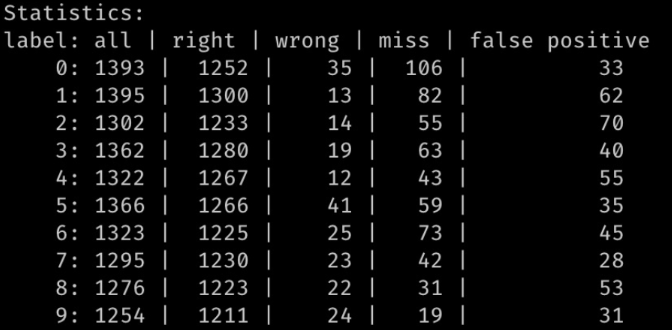
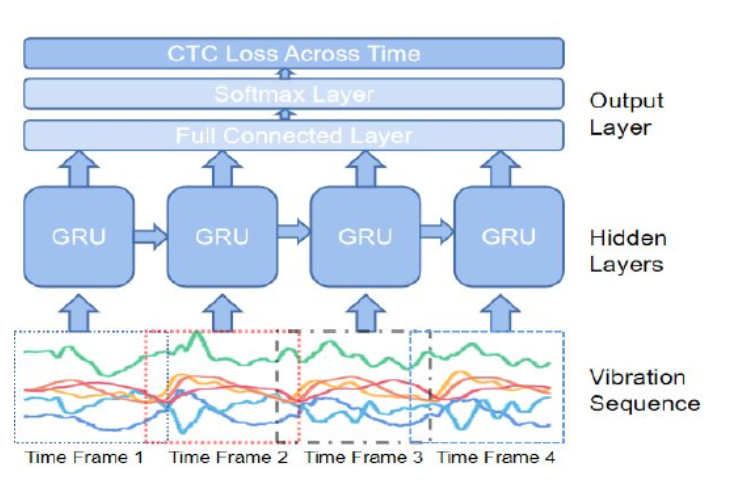
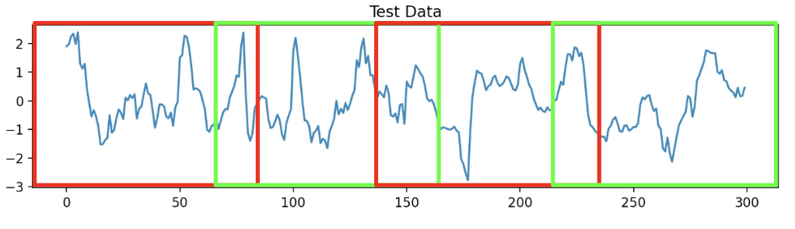
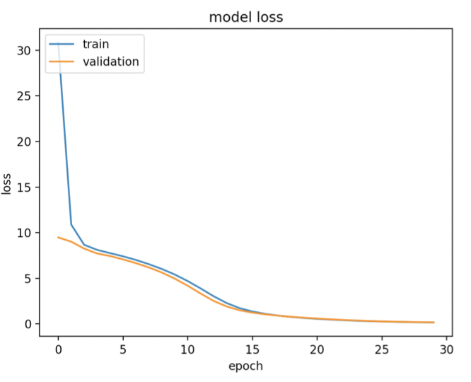
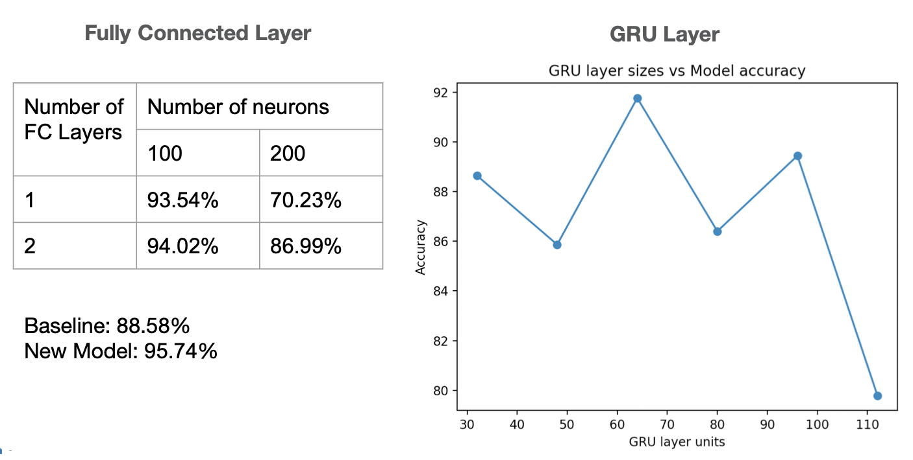

# FINAL REPORT

## Table of Contents

* Abstract
* [Introduction](#1-introduction)
* [Related Work](#2-related-work)
* [Technical Approach](#3-technical-approach)
* [Evaluation and Results](#4-evaluation-and-results)
* [Discussion and Conclusions](#5-discussion-and-conclusions)
* [References](#6-references)

## Abstract

This project explores classifying "air writes" using a common smartwatch, allowing users to freely write letters and numbers with their finger and the overall system capable of identifying and incorporating the gesture. Our project extends off of work previously done by the University of Virginia (ViFin) where they designed a model architecture for classifying signal sequences, but our project specifically addresses key limitations of that research and explores the novel implementation of continuous writing. Our model improvements resulted in a classification accuracy of over 95%, and our chunking method of feeding continuous input data into the model showed great potential, with the fine tuning of the model to further personalize it showing over a 5% improvement over time in model accuracy from the baseline. Overall, our model improvements and added features work to improve the practicality and scalability of this solution.

## 1. Introduction

We aim to design a machine learning model, that allows a user to “air write” letters numbers, and/or symbols by collecting a collection of IMU data the model will be able to predict what the user is air writing into text. 

### Motivation & Objective

The specifics for this project include revamping a model discussed in the ViFin research paper by improving the model architecture, in addition, we will also add the evaluation step of using validation data, instead of only relying on the test data for metrics. Lastly, we want to incorporate a robust future where new users generate new test data for the model to learn from.

### ViFins Limitations

Training step is validated on test dataset
Simple model architecture implementation
Transfer learning based approach not ideal for new users

### Novelty & Impact

The reason why we chose to do this project was due to the fact it has real-world applicability. The team that did ViFin had a great idea and we look to make it even better. The concept of using more and more of the sensors we carry around with us every day isn’t a new one, and in fact, is becoming more and more relent. The idea of converting text you write in the air to actual text can be used in many applications such as accessibility and even just ease of use for a new way to input text into mobile and VR devices.

### Metrics

Edit distance is a metric that can measure the distance between two strings. This was utilized in this project since labels are essentially strings, and we can compare correctness of value and placement of output labels. The edit distance measures the number of transformations required to reach the target string from the source string, being 0 for completely identical strings. Right and wrong indicate placement of output labels, and miss and false positive indicate the correct/incorrect values of output labels. A sample output is shown below, which can further yield overall accuracy.

## 2. Related Work

This is the paper that is the basis of our project was: ***ViFin: Harness Passive Vibration to Continuous Micro Finger Writing with a Commodity Smartwatch***.
In this paper they utilized an artificial neural network (ANN) based on a gradient descent to classify numbers and letters. with this model setup they were able to achieve a final accuracy of 90% for number and 91% for letter classification. They fine tuned their model with smaller training dataset for new users via transfer learning. Additionally, they created a 5-way gesture control using the gyroscope, that allows for spell check and other grammar corrections.

## 3. Technical Approach

The model architecture defined in the ViFin paper is as follows:

The input is provided to a GRU layer followed by a single fully connected softmax activation layer. The model is trained with a CTC loss function, allowing the result labels to be decoded and aligned. CTC (Connectionist temporal classification) allows for alignment of temporal classifications, and the GRU layer is a mechanism for RNN being more efficient with similar performance to LSTM. To address the specific limitations of the ViFin paper, we focused our approach to three steps:

Step 1: Split the provided data into training data, test, and validation data. The ViFin paper validated data using the test dataset, which was also used for final evaluation. Proper data splitting was implemented.

Step 2: Improve our model complexity. Additional learnable parameters in the correct placed would improve overall accuracy and generalizability.

Step 3: Make the model scalable for new users. General approaches, like what was used in the ViFin paper, utilized transfer learning which requires a limited training dataset for each new user. By incorporating user feedback into the pipeline, we can utilize unlabeled predictions in fine-tuning and personalizing the model.

A key novelty of our project was to allow for continuous user input, which required retraining the model allowing for input in a new form we define. We use a overlapping windowing, or "chunking" approach, as seen in the figure below.

By defining a window size and an overlap size, we can extract predictions from the model by feeding in each chunk through the model, and by storing raw results (not the CTC decoded results), we can account for the overlapped regions of the input to retrieve the correct output. This model was trained on a new dataset, chunked according to the configuration specified. Our fine-tuning personalization procedure, modeled after transfer learning techniques, updated the weights of the model with a lower learning rate after each iteration. Since we are generating unlabeled data, user feedback is key in allowing for this system. The ViFin paper already implemented 5 training-free gestures utilizing raw IMU data. We planned to incorporate a sixth gesture for the user to provide feedback on incorrect results, and allow for this fine-tuning "online learning" step.

Utilized Provided Finger Writing Dataset (Numbers 0-9)
Software:
    Google Collab
    Tensorflow
    SensorLog w/ Apple watch Series 7

## 4. Evaluation and Results

If we can implement the dataset given into a model with more advanced complexity and layering then experimented in the paper then we succeed.

Incorporation of the validation dataset allowed for better monitoring of the training step of the model. Common practice in machine learning utilizes a training dataset for training the model, a validation dataset for validating the model after each epoch on an unseen dataset, and a test dataset for final evaluation on an unbiased and unseen dataset. The original research paper validated the model using the test dataset, but validation assists in monitoring over fitting and model selection when performing hyperparameter optimization. We incorporated an 80-10-10 (this is fully configurable) train-validation-test split of the data. We can see proper model training and convergence without over fitting in the new training curve below:

In addition, we wanted to add additional learnable parameters to the simple model architecture presented earlier. This was in two key areas: adding more fully connected layers and making the GRU layer more complex. In the figure below, we see the output model accuracies for different fully connected layer configurations and GRU layer sizes. The optimal combination of these parameters was to use one additional dense layer with 100 neurons and increase the GRU layer size to 64.

Lastly, the continuous input technique based on our "chunking" process resulted in a lower baseline accuracy, around 80%. This is likely due to incorrect dataset generation since the dataset was chunked assuming properly segmented labels (i.e. if a signal with 4 labels is chunked into 4 overlapping regions, then it is assumed that each chunk corresponds to one label). This assumption is likely incorrect, and can be fixed by properly segmenting the dataset in the data preprocessing stage with raw data. Unfortunately, we did not have access to this raw data, since we were given a dataset of processed data, but this can be approached in future iterations of this work.

## 5. Discussion and Conclusions

We look to improve the model they implemented and make it more robust. This paper is brand new (2021) so most of their process is using newer and relevant technology to implement their learning model. For example, we are both using Tensorflow post the TF 2.0 update. Our approach of adding a much need validation set, as well as improving the complexity of the model will hopefully make for better more accurate results.'

Some tidbits for future work; We would have liked to have added validation accuracy, however it was hard to add because CTC decoding was not supported as a tensor operation. A solution that we did not explore would have been to create a validation accuracy metric system from scratch, instead of using tensorflow function. We were also not able to create a CoreML model to test real-time functionality on the apple watch itself. The library to convert Tensorflow models to CoreML models, at the time of this project, does not support converting models that implement CTC. Our way around this shortcoming was to record the real-time data then upload it to be feed into the model for prediction. Additionally, in real world application, users would generate the ground truth labels using a similar prompt system to the one we implemented for test cases (see commented code in test_and_update function). The ViFin paper implemented a nice gesture system and for our case a user gesture that can confirm the correctness prediction would also be a great ease-of-use addition.

## 6. References

* Pengrui Quan & Ziqi Wang Finger Writing Dataset
* Proceedings of the ACM on Interactive, Mobile, Wearable and Ubiquitous TechnologiesVolume 5Issue 1March 2021 Article No.: 45pp 1–25 <https://doi.org/10.1145/3448119>